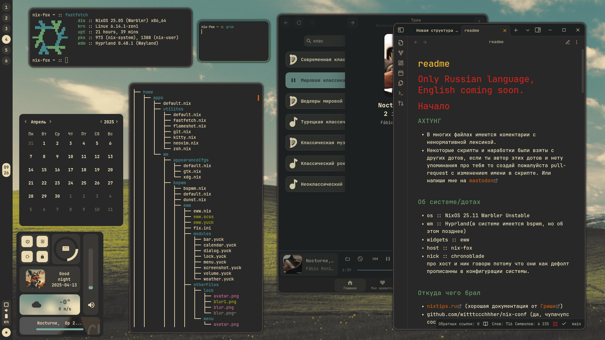

# Only Russian language, English coming soon.
# Начало

## Скриншот


### АХТУНГ
- В многих файлах имеются коментарии с ненормативной лексикой.
- Некоторые скрипты и наработки были взяты с других дотов, если ты автор этих дотов и нету упоминания про тебя то создай пожалуйста pull-request с изменением имени в скрипте. Или напиши мне на [mastodon](https://mastodon.ml/@chronoblade)
### Об системе/дотах
- os :: NixOS 25.11 Warbler Unstable
- wm :: Hyprland(в системе имеется bspwm, но об этом позднее)
- widgets :: eww
- host :: nix-fox
- nick :: chronoblade
	- про хост и ник говорю потому что они как дефолт прописанны в конфигурации системы.
### Откуда чего брал
- [nixtips.ru](https://nixtips.ru) (хорошая документация от [Гриши](https://github.com/witttccchhher))
- github.com/witttccchhher/nix-conf (да, чупачупс сосал со вкусом ананаса)
- [searchix.alanpearce.eu](https://searchix.alanpearce.eu)
- [nixos.wiki](https://nixos.wiki)
- [search.nixos.org](https://search.nixos.org/packages)
### Мини соглашение
- Используя мои доты ты принимаешь:
	- a: То что ты согласен со всеми **наработками** и тд.
	- b: Если ты **ненавистник ai ботов** и всякого такого то рекомендую покинуть мои репозитории, так как большинство всего было написанно с использованием Qwen2.5-Max.
	- c: Доты в открытом доступе. Не имеют никаких ограничений, ты можешь распространять, менять файлы и многое другое.
### Некоторая информация по помощи
- Если у тебя имеются новые виджеты, или готовые идеи по дотам, то милости просим создай pull request.
- Ты всегда можешь обратится ко мне в [mastodon](https://mastodon.ml/@chronoblade) за помощью если что то не будет понятно.
# Структура каталогов
### Основная структура
```
.
├── flake.nix # Импорт системной и домашней конфигурации(inputs) в принимающие функции(outputs)
├── home # Конфигурации относящиеся к home-manager
│   ├── apps # Конфигурации Программ
│   │   ├── default.nix 
│   │   ├── utilites # Утилиты не относящиеся к оконым менеджерам
│   │   │   ├── default.nix
│   │   │   ├── fastfetch.nix
│   │   │   ├── flameshot.nix
│   │   │   ├── git.nix
│   │   │   ├── kitty.nix
│   │   │   ├── neovim.nix
│   │   │   └── zsh.nix 
│   │   └── wm # Конфигурации оконных менеджеров(и не только)
│   │       ├── appearanceCfgs # Настройка тем,иконок,шрифтов
│   │       │   ├── default.nix
│   │       │   ├── gtk.nix # Настройка gtk
│   │       │   └── xdg.nix # Настройка порталов, привязка домашних каталогов
│   │       ├── bspwm 
│   │       │   ├── bspwm.nix
│   │       │   ├── default.nix
│   │       │   ├── dunst.nix
│   │       │   ├── eww/ # Про eww расскажу позднее
│   │       │   ├── picom.nix
│   │       │   ├── rofi # Разраб который написал для него конфиг, я тебя ненавижу.
│   │       │   │   ├── rofi.nix
│   │       │   │   └── rofi.rasi
│   │       │   └── sxhkd.nix
│   │       ├── default.nix
│   │       └── hyprland 
│   │           ├── default.nix
│   │           ├── eww/ # Про eww расскажу позднее
│   │           ├── hypridle.nix
│   │           ├── hyprland.nix
│   │           ├── hyprlock.nix
│   │           ├── hyprpaper.nix
│   │           └── rofi
│   │               ├── rofi.nix
│   │               └── rofi.rasi
│   ├── default.nix
│   └── home # Основные конфигурации home-manager
│       ├── default.nix
│       ├── home.nix # указание юзера, версии, и /home
│       └── packages.nix # пакеты в пользователе chronoblade
└── system
    ├── apps # Системные программы
    │   ├── apps.nix # Программы ввиде pkgs.<program>
    │   └── packages.nix # Программы ввиде services.program.enable 
    ├── default.nix
    ├── etc # Остальные конфигурации
    │   ├── locale.nix
    │   └── networking.nix
    ├── hardware # Конфигурации низкоуровневых штук
    │   ├── boot.nix # Настройка загрузчика, а так же указание модулей
    │   ├── filesystems.nix # указание разделов а так же импорт modulesPath
    │   └── hardware.nix # драйвера nvidia, и тд
    ├── nix # основное про nixOS
    │   ├── nixpkgs.nix # настройки nixpkgs, в основном включение unfree
    │   └── system.nix # Включение эксперементальных опций и версия конфига
    ├── services # Сервисы и юниты
    │   ├── services.nix # Включение сервисов, в основном openssh и xserver
    │   └── units.nix # Юниты systemd, только один юнит на смену частот 
    └── user # Про пользователя
        ├── security.nix # отключенние ввода пароля для отдельных команд, и polkitd
        └── user.nix # указание пользователя, а так же автологин с автовходом в wm
```
### default.nix - это импорты конфигурации в каталоге, они имеются почти во всех директориях кроме начального(для этого есть flake.nix)

## Структура eww(elkowar wacky widgets)
### Указан пример конфигурации bspwm
```
.
├── eww.nix # Основная конфигурация для nix указывающий путь к каталогу и включение eww
├── eww.scss # Основная конфигурация импорта стилей, и указание цветов
├── eww.yuck # Основная конфигурация для импорта модулей
├── fix.ini # Создание воздуха ввиде polybar, только в bspwm!
├── modules # Каталог с модулями, в модулях описанны все части и так далее.
│   ├── bar.yuck
│   ├── calendar.yuck
│   ├── dialog.yuck
│   ├── lock.yuck
│   ├── menu.yuck
│   ├── screenshot.yuck
│   ├── volume.yuck
│   └── weather.yuck
├── otherFiles # Отдельные файлы не относящиеся к конфигурациям
│   ├── lock
│   │   ├── avatar.png
│   │   ├── blur1.png
│   │   ├── blur.png
│   │   └── blur.png~
│   └── menu
│       └── avatar.png
├── scripts # Скрипты для модулей, так как надо все создавать самим
│   ├── bar
│   │   ├── battery.sh
│   │   ├── caps.sh
│   │   ├── layout.sh
│   │   ├── music.sh
│   │   ├── time.sh
│   │   ├── volume.sh
│   │   └── workspace.sh
│   ├── lock
│   │   ├── bind
│   │   ├── start.sh
│   │   └── unlock.sh
│   ├── menu
│   │   ├── good.sh
│   │   └── mem_menu.sh
│   ├── screenshot
│   │   └── text.sh
│   └── weather
│       ├── weather_7days.sh
│       ├── weather_contrycity.sh
│       ├── weather_icon.sh
│       ├── weather.sh
│       ├── weather_widget_close.sh
│       ├── weather_widget_open.sh
│       └── weather_wind.sh
└── scss # Каталог со стилями
    ├── bar.scss
    ├── calendar.scss
    ├── dialog.scss
    ├── lock.scss
    ├── menu.scss
    ├── screenshot.scss
    ├── volume.scss
    └── weather.scss
```
